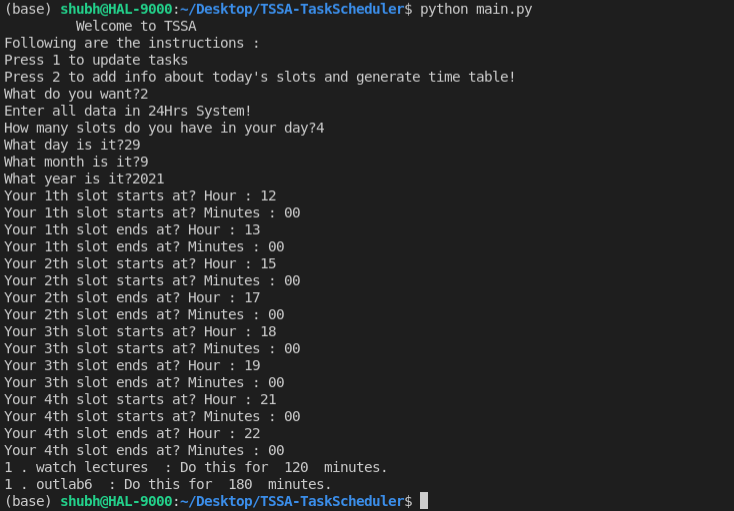

# TSSA : Task Scheduling using Simulated Annealing

Wikipedia describes Simulated Annealing as:

Simulated annealing (SA) is a probabilistic technique for approximating the global optimum of a given function. Specifically, it is a meta-heuristic to approximate global optimization in a large search space for an optimization problem.

The name of the algorithm comes from annealing in metallurgy, a technique involving heating and controlled cooling of a material to alter its physical properties. Both are attributes of the material that depend on their thermodynamic free energy. Heating and cooling the material affects both the temperature and the thermodynamic free energy or Gibbs energy. Simulated annealing can be used for very hard computational optimization problems where exact algorithms fail; even though it usually achieves an approximate solution to the global minimum, it could be enough for many practical problems.

The Metropolis Algorithm carries Simulated Annealing at a constant Temperature.

To run the program, Just go for 

``` python main.py ```

This would give you the options required.

Everything is pretty simple after that.

We got the following results which were much like what we expected : 



In this project, One could see our work on an Ensemble Strategy of Simmulated Annealing and Swarm Particle Optimization in ```useri > interact.py```.

You may have a look at our work on Combinatorial Sampling using Inverse Transform Method in ```annealing > getperm.py```.

Last but not the least you could see our work on contriving the multi-parameter Gibb's Energy Function in ```calculation > calc.py```.
